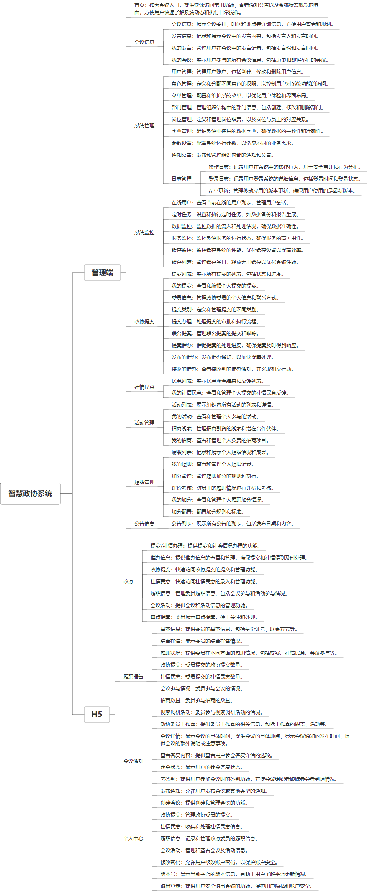

 

    
 

公司拥有上百套具有自主知识产权的软件系统，详情请查看码云首页或公司官网

 
<h1>智慧政协系统</h1>

<a href="https://www.haishi.net.cn/">公司官网</a> ｜ <a href="https://www.haishi.net.cn/">在线体验</a>

 

## 系统介绍

智慧政协系统是一款集成了提案管理、履职跟踪、社情民意收集、会议活动安排、委员信息管理等多功能的政协工作平台，包含APP和WEB两端。该系统通过WEB端为政协工作人员提供全面的政协事务管理功能，包括公告发布、提案处理、履职记录、会议安排、委员信息维护等操作；同时，APP端则为政协委员提供了一个便捷的移动办公工具，可以随时随地进行提案提交、履职信息查询、会议通知接收、社情民意反馈等。智慧政协系统通过两端的数据同步和功能互补，有效提升了政协工作的信息化、智能化水平，增强了政协委员的履职效率，促进了政协工作的透明度和民主化。
智慧政协系统是一款集成了提案管理、履职跟踪、社情民意收集、会议活动安排、委员信息管理等多功能的政协工作平台，包含APP和WEB两端。该系统通过WEB端为政协工作人员提供全面的政协事务管理功能，包括公告发布、提案处理、履职记录、会议安排、委员信息维护等操作；同时，APP端则为政协委员提供了一个便捷的移动办公工具，可以随时随地进行提案提交、履职信息查询、会议通知接收、社情民意反馈等。智慧政协系统通过两端的数据同步和功能互补，有效提升了政协工作的信息化、智能化水平，增强了政协委员的履职效率，促进了政协工作的透明度和民主化。
本项目名称为智慧政协系统，旨在提升政协工作效率和信息化水平，方便委员履职和政协机关管理。该系统涵盖了提案管理、社情民意收集、会议管理、履职管理、公告信息发布等核心功能，并提供H5移动端方便委员随时随地访问和处理相关事务。
本项目从用户层面可以分为两个端：
- 政协管理后台：政协机关工作人员使用，可以进行用户、角色、菜单、部门、岗位、通知公告、日志等系统管理，以及提案办理、委员信息管理、活动管理等。
- H5端：政协委员使用，可以进行提案提交、社情民意反映、履职信息提交、会议活动参与、信息查阅等。
                

## 系统功能介绍

### 系统包含终端说明

管理端（WEB）、用户端（Android APP）

| 序号 | 模块 | 模块说明 |
| --- | --- | --- |
| 1 | ZF-ZHZX-QS-APP | APP |
| 2 | ZF-ZHZX-QS-SERVER | 服务端 |
| 3 | ZF-ZHZX-QS-MANAGE | 管理端 |
| 4 | .idea | 未知类型 |

### 系统功能结构

### 系统功能说明

主要功能：
* **提案管理：** 包括提案提交、提案列表查看、提案办理、联名提案、提案催办等功能，方便委员提交提案、查阅提案办理进度，也方便政协机关进行提案的分类、交办、办理和督办。
* **社情民意：** 提供社情民意提交、列表查看等功能，方便委员反映社情民意，也方便政协机关收集和处理相关信息。
* **会议管理：** 包括会议信息发布、会议发言管理、会议签到等功能，方便政协机关组织和管理会议，也方便委员了解会议信息和参与会议讨论。
* **履职管理：** 包括履职信息提交、履职考核、加分管理等功能，方便委员记录和展示履职情况，也方便政协机关对委员履职情况进行考核和评价。
* **H5移动端：** 提供便捷的移动端访问入口，方便委员随时随地处理提案、社情民意、履职信息等事务，并接收会议通知、催办信息等。
* **系统管理：** 提供用户管理、角色管理、菜单管理、部门管理、岗位管理、通知公告管理、日志管理等功能，方便政协机关进行系统的日常维护和管理。

## 系统主要界面

## 系统技术说明

### 代码模块说明

| 序号 | 目录 | 目录说明 |
| --- | --- | --- |
| 1 | ZF-ZHZX-QS-SERVER/zhengxie-system | -- |
| 2 | ZF-ZHZX-QS-SERVER/zhengxie-common | -- |
| 3 | ZF-ZHZX-QS-SERVER/zhengxie-framework | -- |
| 4 | ZF-ZHZX-QS-SERVER/zhengxie-admin | -- |
| 5 | ZF-ZHZX-QS-SERVER/zhengxie-quartz | -- |
| 6 | ZF-ZHZX-QS-SERVER/zhengxie-generator | -- |

### 系统技术选型

#### 开发语言/框架

JAVA（JDK1.8）
前端框架：uni-app
前端框架：VUE2
脚手架：RuoYi

#### 服务中间件

Nginx
Tomcat

#### 数据库

MySQL（5.7+）
Redis

#### 其他说明

无

## 系统演示/商用

请扫码添加客服微信获取演示地址和系统详细资料。

如果您想基于智慧政协系统进行商业化交付或定制开发服务，我们提供有偿的技术服务支持，合作模式不限，欢迎沟通！

公司官网地址： <a href="https://www.haishi.net.cn/">https://www.haishi.net.cn</a>

联系客服获取专业回答。

## 使用须知

1、 本项目商用必须获得版权所有者的授权。

2、 未经允许本项目代码不允许二次出售。

